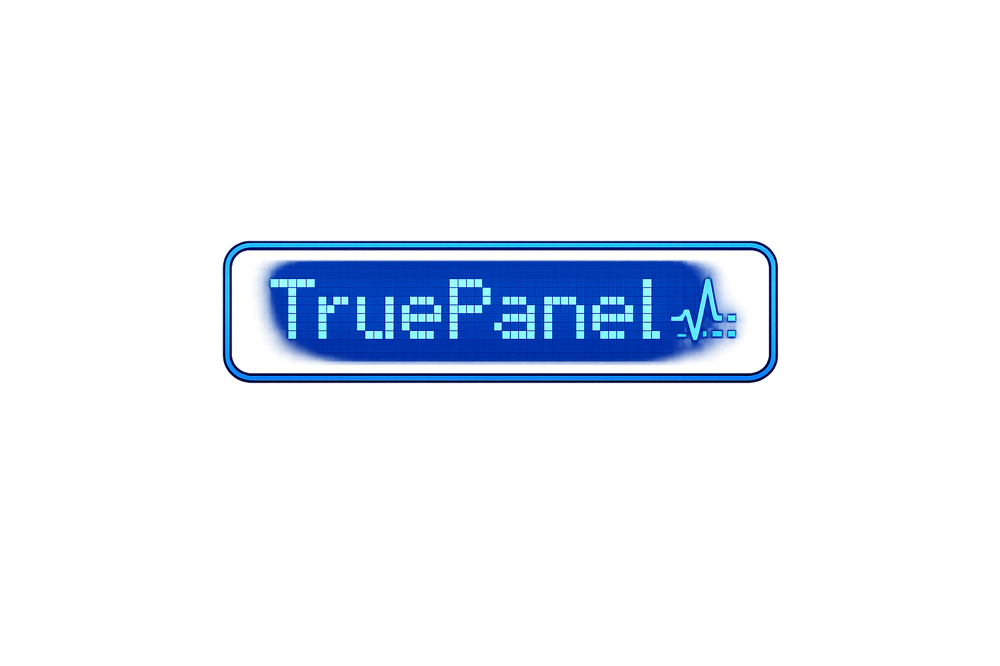
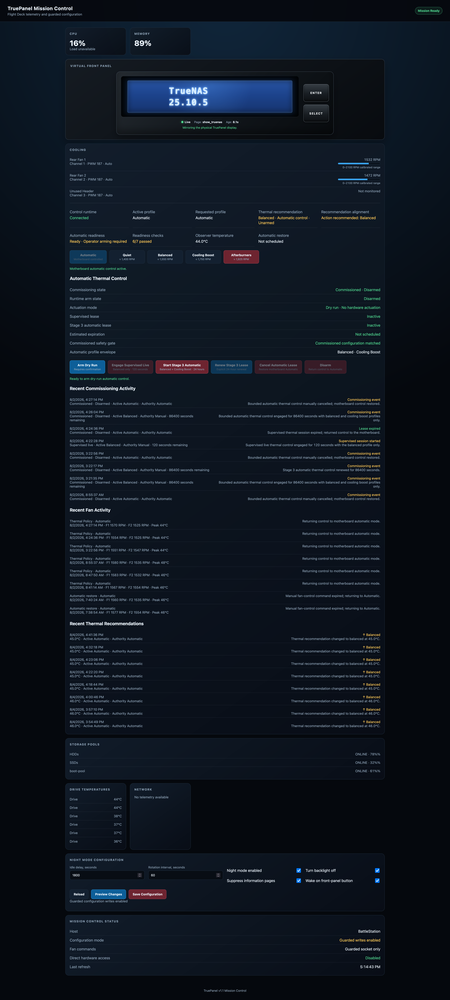
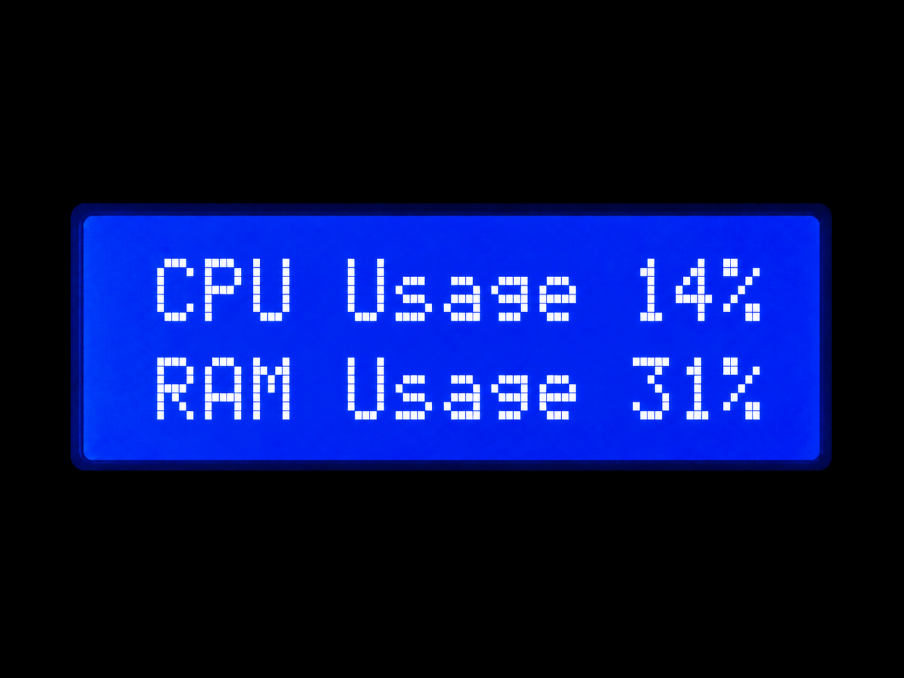
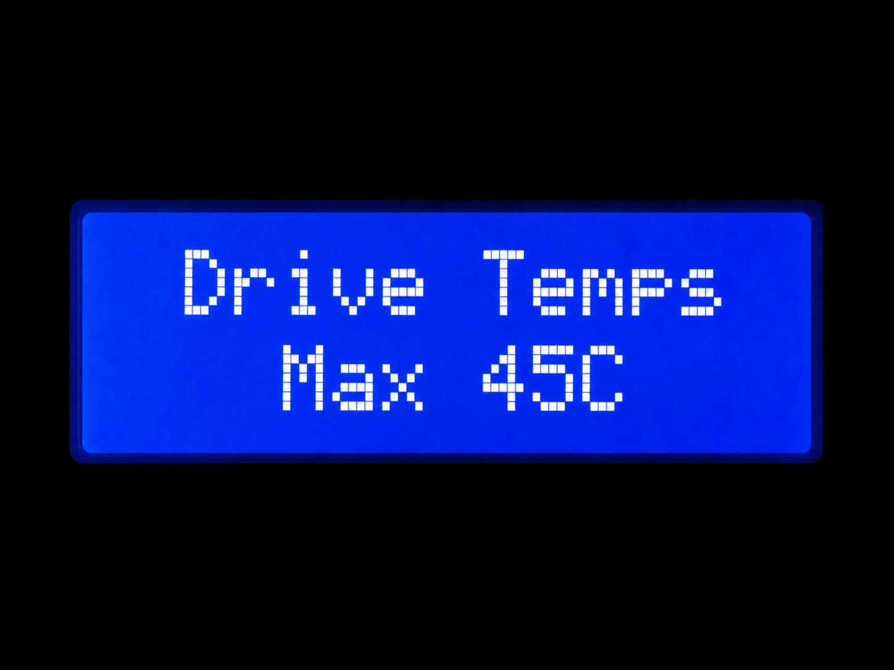
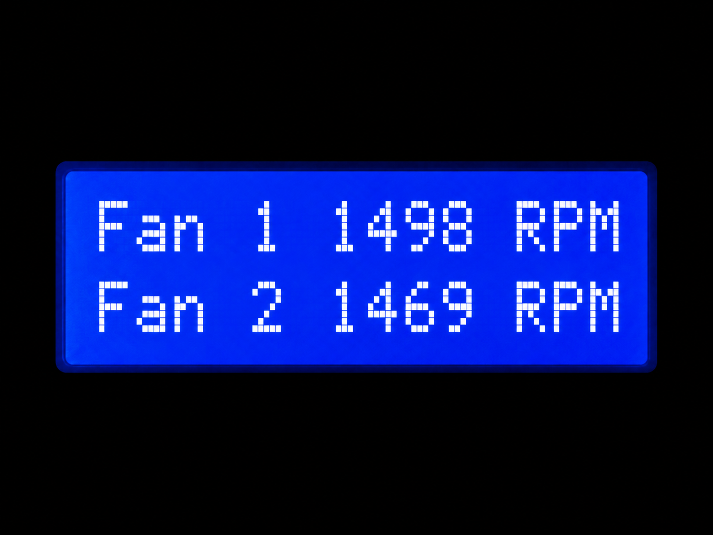
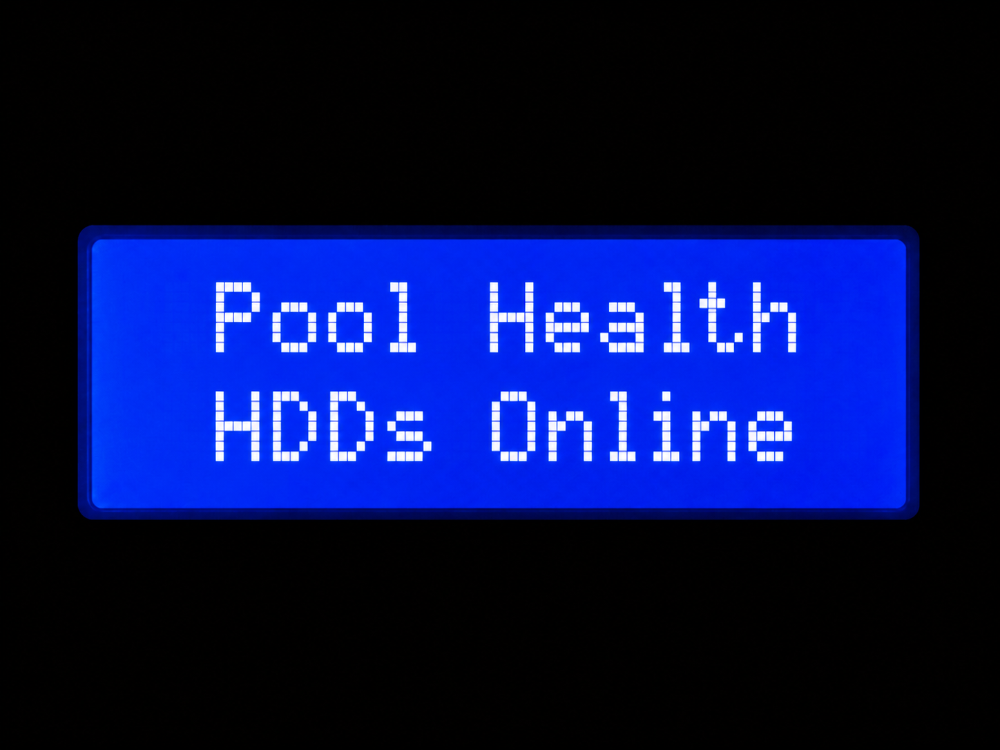

<p align="center">
  
</p>

# TruePanel

<h3 align="center">Hardware-aware mission control and guided recovery for TrueNAS SCALE</h3>

TruePanel restores and extends the physical front-panel experience of supported QNAP hardware running TrueNAS SCALE. It combines a rotating 16x2 LCD Flight Deck, a responsive browser-based Mission Control cockpit, physical-to-logical storage awareness, health intelligence, guided recovery, guarded hardware control, historical evidence, and a deterministic Digital Twin.

The goal is larger than displaying telemetry: when TruePanel identifies a fault, it should help the operator understand the evidence, take the safest useful next step, and verify that the system recovered.

TruePanel began by adapting earlier QNAP LCD utilities, but the current project is an independently developed platform. Its lineage remains preserved in Git history and acknowledgements.

## Platform highlights

### Front-panel Flight Deck

- Rotating system, storage, network, thermal, ZFS, and readiness pages
- A125 native ROM graphics, custom CGRAM instruments, themes, and transitions
- Physical-button navigation with ordered serial ownership
- Storage fault detail without redundant alert-page loops
- Startup diagnostics, idle behavior, night mode, and controlled backlight timing

### Mission Control

- Live CPU, memory, network, storage, fan, thermal, service, and front-panel state
- Responsive cockpit layout designed to remain usable on phones
- Virtual Front Panel that follows the same dispatcher as the physical buttons
- Preflight readiness for Host, Storage, Cooling, Front Panel, and Safety Interlocks
- Privacy-safe compatibility support bundles
- Historical telemetry, event evidence, and guarded configuration surfaces

### Health, recovery, and reliability

- Conservative Health Intelligence for cooling, thermal, storage, network, front-panel, and service faults
- Project Pathfinder recovery sessions from detection through diagnosis, repair guidance, verification, and resolution
- Project Lifeline fail-closed handling for replacement-worthy SMART evidence
- Project ORACLE adaptive baselines and developing-fault analysis
- Project AEGIS correlation of related signals into an evidence-backed probable cause
- A Recovery Coverage Matrix that requires guidance, a fault-specific verifier, deterministic regression coverage, and a passed safe rehearsal

AEGIS is deployed and live-validated on the reference NAS. It remains read-only, preserves the underlying component alerts and evidence, and does not gain hardware or destructive storage authority.

### Safe development and operations

- Project HoloDeck whole-stack Digital Twin for deterministic fault injection
- Privacy-sanitized Black Box recording and replay
- Data-only Incident Compiler for turning failures into regression fixtures
- Guarded install, verify, stage, promote, rollback, repair, cleanup, and uninstall workflows
- Passive Host readiness, fan-safety, acceptance, and compatibility checks
- Model-specific write paths disabled until independently commissioned

## How the reliability stack fits together

| Layer | Responsibility |
| --- | --- |
| Watchers and Health Intelligence | Detect verified component state and explicit faults |
| ORACLE | Learn normal behavior and identify statistically unusual drift |
| AEGIS | Correlate related evidence into a probable root-cause hypothesis |
| Pathfinder | Own the guided recovery workflow and verification state |
| Lifeline | Add deeper fail-closed storage recovery when physical media is involved |
| HoloDeck | Rehearse failure and recovery paths without production hardware |
| Black Box | Preserve sanitized, replayable evidence |

These layers have deliberately separate authority. Statistical drift cannot invent a hard fault, a correlation cannot hide its contributing alerts, and the reliability layer cannot actuate hardware.

## Verified reference platform

The production reference system is:

- QNAP TVS-671
- TrueNAS SCALE 25.10.5
- Python 3.11
- A125 LCD controller on `/dev/ttyS1` at 1200 baud
- Six drive-bay identify LEDs through `/dev/i2c-0`, SMBus address `0x33`
- Fintek F71869A hardware monitor using `f71882fg`
- Two verified chassis fan-control channels

Other QNAP systems may share portions of this design, but they remain unverified until their controller paths, telemetry, and command maps are reproduced safely.

## Check compatibility before installation

Run the passive compatibility survey before TruePanel is installed on unknown hardware:

```bash
git clone https://github.com/johnnyvontruant/TruePanel.git
cd TruePanel
python3 truepanel.py compatibility
```

The survey does not open the LCD controller, change fan PWM, operate bay LEDs, modify pools, or grant hardware-control authority. Results are classified as `SUPPORTED`, `PARTIAL`, `REVIEW`, or `UNSUPPORTED`.

A `SUPPORTED` result means the system is suitable for the documented observation-first workflow. It does **not** authorize active fan, LED, LCD, or other hardware control. Hardware control remains locked until the relevant hardware has been separately verified and commissioned.

Generate a privacy-safe support bundle when review is needed:

```bash
python3 truepanel.py compatibility \
  --support-bundle \
  --output truepanel-support.json
```

Support bundles exclude hostnames, IP addresses, drive serial numbers, WWIDs, MAC addresses, usernames, configuration secrets, and pool contents.

## Installation

Use an operator-selected persistent dataset path:

```bash
git clone https://github.com/johnnyvontruant/TruePanel.git
cd TruePanel
python3 truepanel.py compatibility
sudo bash install.sh --root /mnt/POOL/DATASET/TruePanel
```

The installer creates an isolated Python runtime, the LCD and Mission Control services, a dormant marker-gated Host Agent unit, and an enabled TrueNAS `POSTINIT` task for `i2c-dev`. It leaves application services stopped so activation remains explicit:

```bash
sudo systemctl enable --now truepanel.service
sudo systemctl enable --now truepanel-mission-control.service
```

Then verify the deployed contract:

```bash
sudo /mnt/POOL/DATASET/TruePanel/bin/truepanel verify \
  --root /mnt/POOL/DATASET/TruePanel
sudo /mnt/POOL/DATASET/TruePanel/bin/truepanel host acceptance \
  --root / \
  --config /mnt/POOL/DATASET/TruePanel/truepanel.yaml
```

Read the [Installation Guide](docs/INSTALLATION.md) before deployment. TruePanel uses an operator-selected dataset plus systemd and the TrueNAS middleware API; this remains outside TrueNAS's officially supported application path and should be managed with current backups and explicit verification.

## Mission Control

Mission Control is the browser companion service at port `8787`. It is localhost-bound and read-only by default. Trusted LAN or Tailscale access can be enabled by deliberately changing the bind address and applying appropriate network controls.

The Virtual Front Panel never takes direct serial ownership. Its controls use the local LCD command socket and the same ordered dispatcher as physical button reports.

See the [Mission Control Guide](docs/MISSION_CONTROL.md) for the cockpit, Preflight, Health Intelligence, Pathfinder recovery, Lifeline, AEGIS, mobile behavior, and access boundaries.

<p align="center">
  
</p>

## LCD Flight Deck

<p align="center">
  
  
</p>

<p align="center">
  
  
</p>

## Command line

Common entry points include:

```bash
truepanel doctor
truepanel version
truepanel compatibility
truepanel compatibility --support-bundle
truepanel verify --root /mnt/POOL/DATASET/TruePanel
truepanel host readiness
truepanel host fan-safety --config /mnt/POOL/DATASET/TruePanel/truepanel.yaml
truepanel host acceptance --root / --config /mnt/POOL/DATASET/TruePanel/truepanel.yaml
truepanel mission-control status
truepanel holodeck --help
truepanel plugins
truepanel themes list
truepanel hardware --help
truepanel lab --help
```

See the [CLI Reference](docs/CLI.md), [Upgrade and Rollback Guide](docs/UPGRADING.md), and [HoloDeck Guide](docs/HOLODECK.md).

## Documentation

- [Documentation map](docs/README.md)
- [Mission Control and reliability](docs/MISSION_CONTROL.md)
- [Installation](docs/INSTALLATION.md)
- [Upgrade and rollback](docs/UPGRADING.md)
- [Architecture](docs/ARCHITECTURE.md)
- [Hardware support](docs/HARDWARE.md)
- [CLI reference](docs/CLI.md)
- [Project HoloDeck](docs/HOLODECK.md)
- [Project AEGIS](docs/PROJECT_AEGIS.md)
- [Project HANGAR](docs/PROJECT_HANGAR.md)
- [Flight Director Prior-Art Field Report](docs/FLIGHT_DIRECTOR_PRIOR_ART.md)
- [Project Stargate](docs/STARGATE.md)
- [A125 protocol](docs/A125_PROTOCOL.md)
- [Plugin API](docs/PLUGIN_API.md)
- [Historical telemetry](docs/HISTORICAL_TELEMETRY.md)
- [Development guide](docs/DEVELOPMENT.md)
- [Roadmap](docs/ROADMAP.md)
- [Philosophy](docs/PHILOSOPHY.md)

## Safety

TruePanel can communicate with serial, SMBus, GPIO, Super I/O, buzzer, enclosure, fan, and storage-related interfaces. Production writes are constrained to verified command maps and guarded control paths.

Do not perform generic I2C scans, random register writes, direct serial experiments while the LCD service owns the controller, manual fan sysfs writes, or destructive storage experiments on production hardware.

TruePanel's reliability systems are designed to explain and verify recovery. They do not convert a diagnostic hypothesis into automatic repair authority.

## Release status

TruePanel 1.3.0 is the release candidate line for the current reliability and guided-recovery stack. It includes Pathfinder, Lifeline, ORACLE, AEGIS, HANGAR, Flight Director, GLASS COCKPIT, supported TrueNAS `i2c-dev` boot persistence, and physical-bay localization for drive-temperature reliability evidence. The major post-1.2 capabilities have been deployed and live-validated on the reference BattleStation while preserving their documented safety boundaries.

Every promoted change is expected to pass focused regression coverage, the complete GitHub Actions suite, installed-wheel smoke testing, and the applicable HoloDeck or physical-hardware validation gate.

See the [Changelog](CHANGELOG.md) for release and development history.

## License and lineage

TruePanel is distributed under the repository license. Earlier QNAP LCD work provided the initial spark; the modern architecture, Flight Deck, Mission Control, recovery and reliability systems, HoloDeck, Stargate laboratory, telemetry, hardware abstraction, and TVS-671 controls were developed as TruePanel. Git history preserves the complete lineage.
