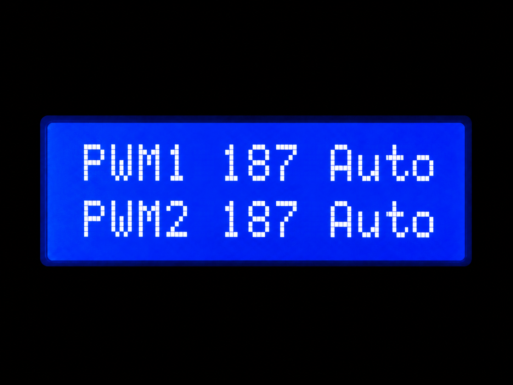
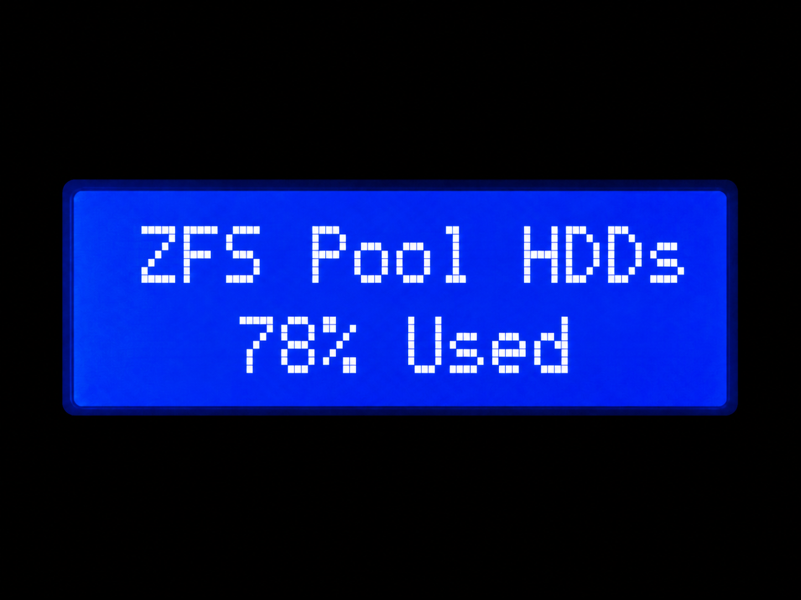
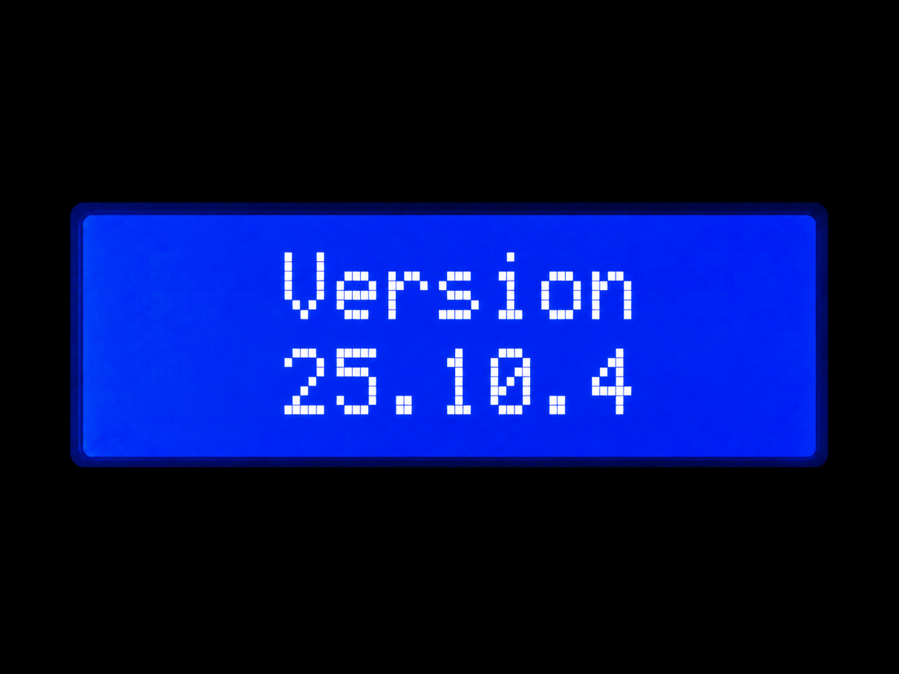
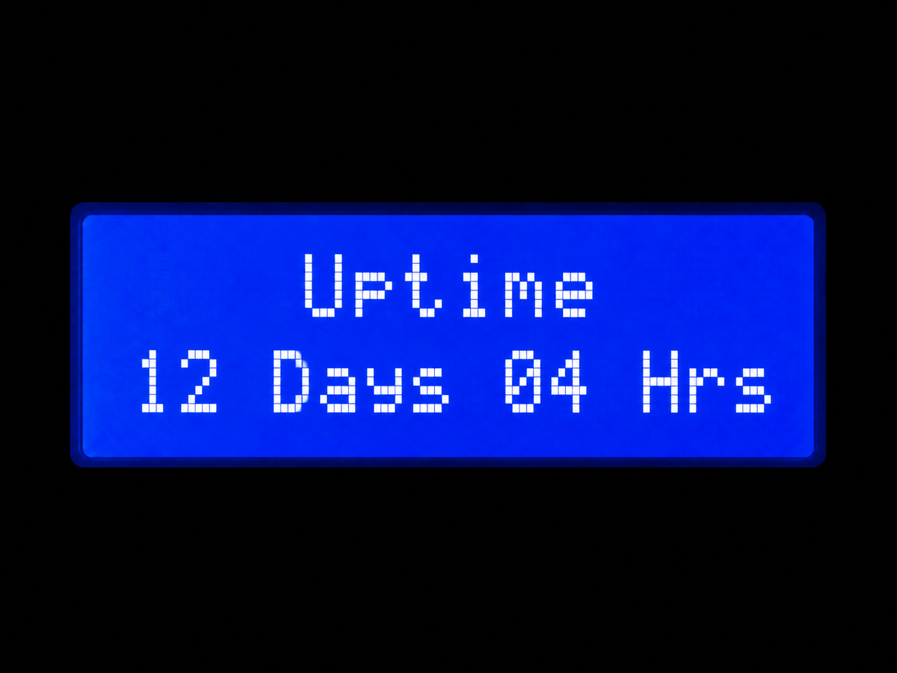
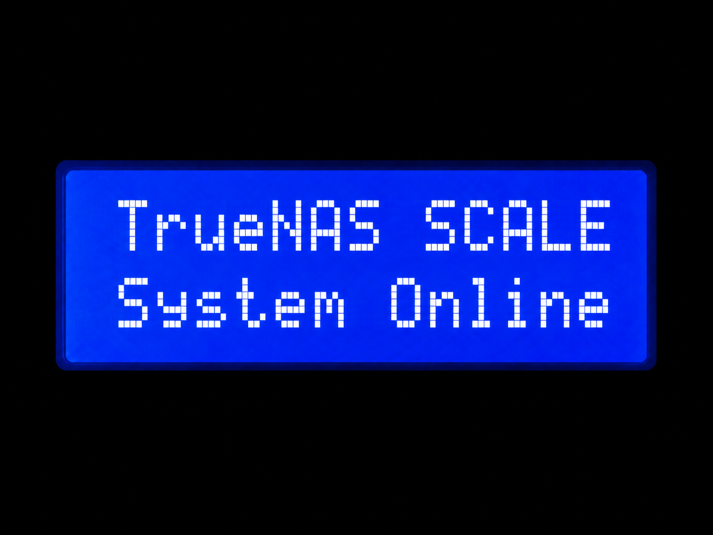
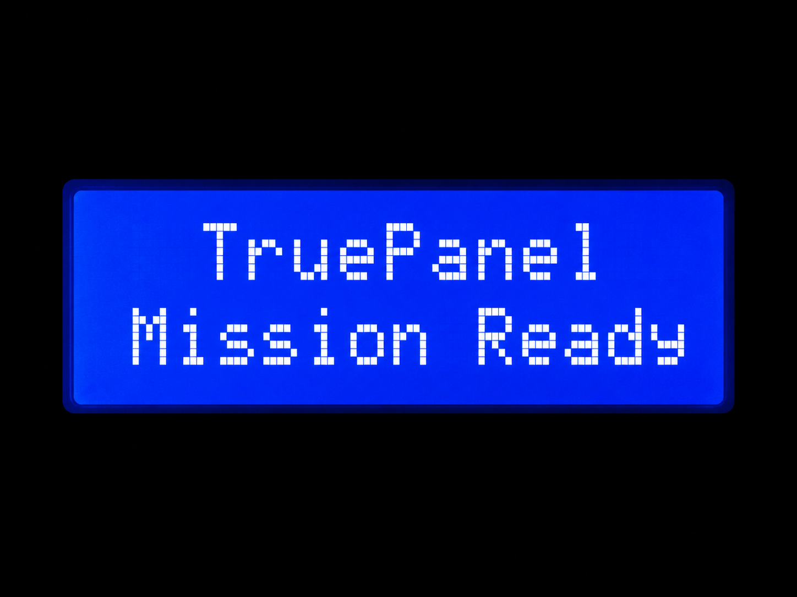
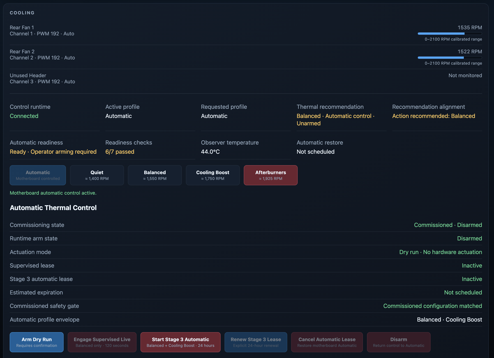
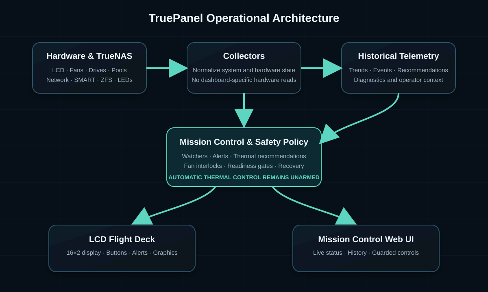

<p align="center">
  
</p>
# TruePanel

<h3 align="center">Hardware-aware mission control for TrueNAS SCALE</h3>

TruePanel turns supported QNAP front-panel hardware into a live operational dashboard for TrueNAS SCALE. It combines a rotating LCD Flight Deck, structured health monitoring, historical telemetry, guarded hardware controls, plugins, and a reverse-engineering laboratory built around reproducible safety rules.

TruePanel began by adapting earlier QNAP LCD utilities, but the current project is an independently developed platform. The original lineage remains preserved in Git history and acknowledgements.

## What TruePanel does

- Rotates system, storage, network, thermal, and ZFS pages on a 16x2 front-panel LCD
- Renders native A125 ROM graphics and custom CGRAM instruments
- Tracks pool health, SMART state, drive temperatures, storage topology, and ZFS operations
- Records historical telemetry for trends and diagnostics
- Routes drive-specific faults to the matching physical bay identify LED
- Keeps detailed storage information available on the LCD without redundant interrupt pages
- Supports buttons, backlight, buzzer patterns, themes, plugins, simulation, and diagnostics
- Provides live Mission Control telemetry and history
- Provides guarded manual fan profiles and restoration
- Evaluates thermal recommendations and readiness
- Provides Project Stargate tools for guarded A125 and QNAP hardware research

## Verified platform

The production reference system is:

- QNAP TVS-671
- TrueNAS SCALE
- Python 3.11
- A125 LCD controller on `/dev/ttyS1` at 1200 baud
- Six drive-bay identify LEDs through `/dev/i2c-0`, SMBus address `0x33`
- Fintek F71869A monitor using `f71882fg`
- Two verified chassis fan-control channels

Other QNAP systems may share parts of this hardware design, but they must be treated as unverified until their controller paths and command maps are reproduced safely.

## Check compatibility before installation

Unknown or unverified systems should be surveyed before TruePanel is installed.

Clone the repository, enter the project directory, and run the passive compatibility survey before deploying services:

```bash
git clone https://github.com/johnnyvontruant/TruePanel.git
cd TruePanel
python3 truepanel.py compatibility
```

The compatibility survey is read-only. It inspects passive operating-system and hardware signals such as TrueNAS version, architecture, DMI identity, hwmon fan interfaces, enclosure topology, storage classification, and front-panel serial-device presence.

It does **not** open the LCD serial controller, change fan PWM values, operate bay LEDs, modify pools, change configuration, or grant hardware-control authority.

Compatibility results are classified as:

- `SUPPORTED` - the passive capabilities required by the current TruePanel platform were detected
- `PARTIAL` - useful TruePanel capabilities were detected, but some expected hardware interfaces are unavailable
- `REVIEW` - the system requires manual compatibility review before deployment
- `UNSUPPORTED` - a required platform condition is not currently supported

A `SUPPORTED` result means the system is suitable for the documented observation-first workflow. It does **not** authorize active fan, LED, LCD, or other hardware control. Hardware control remains locked until the relevant hardware has been separately verified and commissioned.

For an unknown system, generate a privacy-safe support bundle:

```bash
python3 truepanel.py compatibility \
  --support-bundle \
  --output truepanel-support.json
```

The support bundle intentionally excludes hostnames, IP addresses, drive serial numbers, WWIDs, MAC addresses, usernames, configuration secrets, and pool contents. It can be shared when requesting compatibility review without exposing those identifiers.

Only proceed to installation after the compatibility result and any `REVIEW` items have been understood.

## LCD Flight Deck

TruePanel turns the QNAP front-panel LCD into a rotating
operational display for system health, storage, cooling,
uptime, and platform status.

<p align="center">
  
  
</p>

<p align="center">
  
  
</p>

<p align="center">
  
  
</p>

<p align="center">
  
  
</p>

<p align="center">
  
  
</p>

## Mission Control

Mission Control is TruePanel's browser-based companion dashboard.
It combines live telemetry, storage health, fan RPM and PWM state,
guarded manual profiles, thermal recommendations, readiness checks,
and operational history.

The dashboard also includes a live virtual front panel that mirrors
the physical 16x2 LCD. Its guarded ENTER and SELECT controls travel
through a local Unix socket and the same ordered dispatcher used by
the hardware buttons, so Mission Control never takes direct serial
ownership.

### Dashboard overview and virtual front panel

<p align="center">
  
</p>

### Cooling and thermal readiness

<p align="center">
  
</p>

Automatic thermal control remains deliberately unarmed.
TruePanel observes, recommends, evaluates readiness, and explains
blockers without autonomously changing fan profiles.

## Architecture at a glance

<p align="center">
  
</p>

TruePanel uses a collector-first architecture. Hardware and TrueNAS
providers produce normalized state, safety services evaluate it,
and the LCD Flight Deck and Mission Control render the result.

The normal runtime is launched through:

```text
truepanel.py -> truepanel.cli -> lcd-menu.py
```

The TVS-671 reference deployment lives under `/mnt/SSDs/Applications/TruePanel` and starts through TrueNAS POSTINIT tasks. Other systems should use an operator-selected persistent dataset path such as `/mnt/POOL/DATASET/TruePanel`.

## Installation

For verified hardware, or after completing the compatibility workflow above:

```bash
git clone https://github.com/johnnyvontruant/TruePanel.git
cd TruePanel
python3 truepanel.py compatibility
sudo bash install.sh
```

Then verify:

```bash
sudo /mnt/POOL/DATASET/TruePanel/bin/truepanel doctor
sudo systemctl status truepanel
sudo journalctl -u truepanel -f
```

TrueNAS administrators should read [Installation](docs/INSTALLATION.md) before deployment. TruePanel installs files under `/opt` and creates a systemd service, which may fall outside the configuration mechanisms officially supported by TrueNAS.

## Command line

```bash
truepanel doctor
truepanel version
truepanel compatibility
truepanel compatibility --support-bundle
truepanel plugins
truepanel themes list
truepanel hardware --help
truepanel lab --help
truepanel mission-control status
truepanel simulate --help
```

See [CLI Reference](docs/CLI.md).

Mission Control runs as an independent web companion service. It is localhost-bound and read-only by default. See the [Installation Guide](docs/INSTALLATION.md) for LAN access and guarded-write configuration.

## Documentation

- [Documentation map](docs/README.md)
- [Installation](docs/INSTALLATION.md)
- [Architecture](docs/ARCHITECTURE.md)
- [Hardware support](docs/HARDWARE.md)
- [CLI reference](docs/CLI.md)
- [Project Stargate](docs/STARGATE.md)
- [A125 protocol](docs/A125_PROTOCOL.md)
- [Plugin API](docs/PLUGIN_API.md)
- [Historical telemetry](docs/HISTORICAL_TELEMETRY.md)
- [Project HoloDeck Digital Twin](docs/HOLODECK.md)
- [Development guide](docs/DEVELOPMENT.md)
- [Project history](docs/HISTORY.md)
- [Roadmap](docs/ROADMAP.md)
- [Philosophy](docs/PHILOSOPHY.md)

## Repository structure

```text
truepanel/                 Production package
tests/                     Automated test suite
docs/                      User and developer documentation
docs/images/               Diagrams and screenshots
development/tools/         Reproducible Stargate laboratory tools
examples/plugins/          External plugin examples
plugins/                   Locally installed plugins and runtime state
collector.py               TrueNAS state collector used by the live service
lcd-menu.py                Production Flight Deck runtime
truepanel.py               CLI compatibility launcher
truepanel.yaml             Reference configuration
install.sh                 Native installer
uninstall.sh               Native uninstaller
```

Generated captures, extracted firmware, compiled probes, caches, backups, runtime plugin state, and local telemetry are intentionally excluded from Git.

## Safety

TruePanel can communicate with serial, SMBus, GPIO, Super I/O, buzzer, and enclosure hardware. Production controls are constrained to verified command maps. Project Stargate uses explicit interlocks, simulation modes, exclusive ownership, and narrow command catalogs.

Do not perform generic I2C scans, random register writes, or destructive storage experiments on production hardware.

## Project status

TruePanel is active software. The consolidated platform passed **1,507 automated tests** on August 9, 2026. Hardware support beyond the TVS-671 reference system remains experimental until independently verified.

## License and lineage

TruePanel is distributed under the repository license. Earlier QNAP LCD work provided the initial spark; the modern architecture, Flight Deck, Mission Control, Project Stargate laboratory, telemetry, hardware abstraction, and TVS-671 controls were developed as TruePanel. Git history preserves the full lineage.

## Stable release

TruePanel 1.1.0 expands the stable platform with guarded fan control,
thermal-policy observation, Mission Control cooling telemetry,
LCD startup effects, and refreshed project branding.

Release resources:

- [Changelog](CHANGELOG.md)
- [Installation guide](docs/INSTALLATION.md)
- [Upgrade and rollback guide](docs/UPGRADING.md)
- [Security policy](SECURITY.md)
- [Contributing guide](CONTRIBUTING.md)
